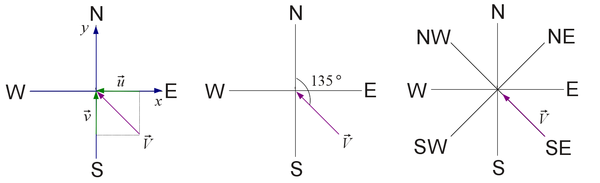

```{r setup, include=FALSE}
knitr::opts_chunk$set(echo = TRUE)
```

_______________________________________________________________________________
# Lista dos exercícios do capítulo 7.14 do ebbok ADAR

## Exercício 1

Crie um vetor com os valores de $e^{x}cosx$ para os valores de $x=(3,3.1,3.2,...,6)$.

```{r}
x_1 <- seq(from = 3, to = 6, by = 0.1)
x_1
vetor_1 <- exp(x_1) * cos(x_1)
vetor_1
```
_______________________________________________________________________________
## Exercício 2

Crie os seguintes vetores:

a. $(0.1³×0.2¹,0.1⁶×0.2⁴,...,0.1^{36}×0.2^{34})$
```{r}
(x_2 <- seq(from = 3, to = 36, by = 3))
(y_2 <- x_2 - 2)
vetor_2 <- 0.1^(x_2) * 0.2^(y_2)
vetor_2
```
    
b. $(2,{2^{2}}/2,{2^{3}}/3,...,{2^{25}}/25)$
```{r}
(x_3 <- seq(from = 2, to = 25, by = 1))
vetor_3 <- 2^(x_3) / x_3
vetor_3
```
_______________________________________________________________________________
## Exercício 3

Reproduza a criação do vetor dias da semana $(dds)$ mostrado abaixo:

```{r}
dias <- c("domingo", "segunda", "terca", "quarta", "quinta", "sexta", "sabado")
dds <- c(1:7)
names(dds) <- dias
dds
```
_______________________________________________________________________________
## Exercício 4

Interprete o resultado da seguinte operação:

```{r}
dds_nums <- c(
  5L, 2L, 5L, 2L, 7L, 7L, 2L,
  6L, 6L, 3L, 7L, 1L, 2L, 2L,
  5L, 7L, 3L, 2L, 6L, 4L, 1L
)
names(dds)[dds_nums]
```

Interpretação: através da indexação os números do dds_nums representam os dias da semana.
_______________________________________________________________________________
## Exercício 5

a. Escreva o código necessário para determinar o vetor lógico indicando quais números são pares na sequência de valores 85, 79, 70, 6, 32, 8, 17, 93, 81, 76.

```{r}
x_4 <- c(85, 79, 70, 6, 32, 8, 17, 93, 81, 76)
pares <- x_4 %% 2 == 0
pares
```

b. Calcule o total de números ímpares.

```{r}
x_4 <- c(85, 79, 70, 6, 32, 8, 17, 93, 81, 76)
impares <- x_4 %% 2 != 0
total_impares <- sum(impares)
total_impares
```
_______________________________________________________________________________
## Exercício 6

Para um ano ser bissexto, ele deve ser:

 - divísivel por 4 (a divisão é exata com resto igual a zero);

 - não pode ser divisível por 100 (a divisão não é exata, ou seja, o resto é diferente de zero);

 - pode ser que seja divisível por 400: caso seja divisível por 400, a divisão deve ser exata, deixando o resto igual a zero.

Com os critérios definidos acima, construa o código para:

a. Verificar se os anos 1894, 1947, 1901, 1992, 1925, 2014, 1993, 1996, 1984, 1897, 2100, 2300 são bissextos.

```{r}
anos <- c(1894, 1947, 1901, 1992, 1925, 2014, 1993, 1996, 1984, 1897, 2100, 2300)
bissextos <- (anos %% 4 == 0 & anos %% 100 != 0) | (anos %% 400 == 0)
bissextos
```

b. Mostre quais anos são bissextos.

```{r}
anos[bissextos]
```

c. Usando o código para verificar se o ano é bissexto, gere um vetor nomeado ndias com o número de dias do ano para os anos do item (a).

```{r}
ndias <- ifelse(test = bissextos, yes = 366, no = 365)
names(ndias) <- anos
ndias
```

d. Programe como obter o total de anos com 366 dias?

```{r}
total_bissextos <- sum(bissextos)
total_bissextos
```
_______________________________________________________________________________
## Exercício 7

Quais códigos para gerar os seguintes dados:

a. 
```{r echo=FALSE}
c(-30, 0, 5, 10, 15, 20, 30)
```
```{r}
x_5 <- c(-30, seq(0, 20, by = 5), 30)
x_5
```

b. 
```{r echo=FALSE}
c(1.0, 0.8, 0.6, 0.4, 0.2, 0.0)
```
```{r}
x_6 <- seq(1, 0, by = -0.2)
x_6
```

c. 
```{r echo=FALSE}
c(-3.1415927, -2.4434610, -1.7453293, -1.0471976, -0.3490659,  0.3490659,
  1.0471976,  1.7453293,  2.4434610,  3.1415927)
```
```{r}
x_7 <- seq(-pi, pi, by = 0.6981317)
x_7
```

d. 
```{r echo=FALSE}
c(-1, -1, 0, 0, 0, 1, 1, 1, 1, 2, 2, 2, 2, 2, 3, 3, 3, 3, 3, 3, 4, 4, 4, 
  4, 4, 4, 4, 5, 5, 5, 5, 5, 5, 5, 5)
```
```{r}
x_8 <- rep(-1:5, times = 2:8)
x_8
```

e.
```{r echo=FALSE}
c(5, 5, 5, 5, 5, 4, 4, 4, 4, 3, 3, 3, 2, 2, 1, 2, 2, 3, 3, 3, 4, 4, 4, 4, 5, 5, 5, 5, 5)
```
```{r}
x_9 <- c(rep(5:2, times = 5:2), 1, rep(2:5, times = 2:5))
x_9
```
_______________________________________________________________________________
## Exercício 8

Usando o mesmo código para solução em todos os itens abaixo, obtenha as seguintes sequências usando os vetores fornecidos.

a. $v3 = (11, 0.25, 7, 2)$
```{r echo=FALSE}
c(1, 2, 3, 4)
```
```{r}
v3 <- c(11, 0.25, 7, 2)
seq_v3 <- seq_along(v3)
seq_v3
```

b. $v2 = (11, 0.25)$
```{r echo=FALSE}
c(1, 2)
```
```{r}
v2 <- c(11, 0.25)
seq_v2 <- seq_along(v2)
seq_v2
```

c. $v1 = (11)$
```{r echo=FALSE}
c(1)
```
```{r}
v1 <- c(11)
seq_v1 <- seq_along(v1)
seq_v1
```

d. $v0 = ()$
```{r echo=FALSE}
v0 <- c()
(seq_v0 <- seq_along(v0))
```
```{r}
v0 <- c()
seq_v0 <- seq_along(v0)
seq_v0
```
_______________________________________________________________________________
## Exercício 9

Considere os seguintes dados horários de temperatura do ar $(T_{ar})$ registrados em duas estações meteorológicas, entre as 0 e 23 horas de um dado dia.

```{r}
tar_est1 <- c(
  14.92, 14.61, 14.32, 14.07, 13.84, 13.65, 13.56, 13.97, 15.08,
  16.5, 17.88, 19.08, 20.02, 20.66, 21.01, 21.05, 20.76, 20.05,
  18.77, 17.51, 16.67, 16.11, 15.66, 15.27
)
tar_est2 <- c(
  13.13, 13.01, 12.93, 12.87, 12.82, 12.81, 13.2, 14.22, 15.77,
  17.49, 19.2, 20.57, 21.49, 22.01, 22.03, 21.71, 20.84, 18.77,
  16.54, 15.13, 14.34, 13.81, 13.49, 13.28
)
```

    Dica: Faça um gráfico para visualizar as temperaturas das duas estações. Isso facilitará a solução.

a. Determine a média diária da $(T_{ar})$ das duas estações arrendondando para uma casa decimal. Salve a média de cada estação nas variáveis tmed_est1 e tmed_est2.

```{r}
(tmed_est1 <- round(mean(tar_est1), 1))
(tmed_est2 <- round(mean(tar_est2), 1))
```


b. Utilizando as variáveis do item anterior, verifique usando comparação lógica, em qual estação o ambiente é mais quente?

```{r}
medias <- c(tmed_est1, tmed_est2)
names(medias) <- c("tmed_est1", "tmed_est2")
medias[which.max(medias)]
```

c. Obtenha a 3ª maior temperatura do dia em cada estação.

```{r}
(terceira_maiorT_est1 <- sort(tar_est1, decreasing = TRUE)[3])
(terceira_maiorT_est2 <- sort(tar_est2, decreasing = TRUE)[3])
```

d. Calcule a amplitude térmica diária ($ATD=Tmax−Tmin$, onde $Tmax$: temperatura máxima dária e $Tmin$: temperatura mínima dária) das estações 1 e 2, arrendondando para uma casa decimal. Salve os resultados nas variaveis atd_est1 e atd_est2.

```{r}
Tmax2 <- max(tar_est2)
Tmax1 <- max(tar_est1)
Tmin2 <- min(tar_est2)
Tmin1 <- min(tar_est1)

(atd_est1 <- round(Tmax1 - Tmin1, 1))
(atd_est2 <- round(Tmax2 - Tmin2, 1))
```

e. Qual o horário de ocorrência das temperaturas máximas e mínimas em cada estação? Salve os resultados nas variáveis hmax_est{i} e hmin_est{i}, com $i=1,2$.

```{r}
temps <- list(tar_est1, tar_est2)
hmax_est <- list()
hmin_est <- list()
for (i in 1:2) {
  hmax_est[[i]] <- which.max(temps[[i]])
  hmin_est[[i]] <- which.min(temps[[i]])
}
names(hmax_est) <- paste0("hmax_ext", 1:2)
names(hmin_est) <- paste0("hmim_ext", 1:2)
hmax_est
hmin_est

#salvar as variáveis separadamente:
for (i in 1:2) {
  assign(paste0("hmax_est", i), which.max(temps[[i]]))
  assign(paste0("hmin_est", i), which.min(temps[[i]]))
}
```

f. Quando tar_est2 é maior que tar_est1 qual a maior diferença absoluta de temperatura entre as duas estações?

```{r}
diferencas <- abs(tar_est2 - tar_est1)
dif_valida <- diferencas[tar_est2 > tar_est1]
maior_dif <- max(dif_valida)
maior_dif
```


g. Qual a hora correspondende a ocorrência daquela maior diferença absoluta de temperatura obtida no item anterior?

```{r}
horas <- 0:23
indice_maior_dif <- which(diferencas == maior_dif & tar_est2 > tar_est1)
hora_maior_dif <- horas[indice_maior_dif]
hora_maior_dif
maior_dif
```

h. O horário do pôr do sol pode ser estimado a partir da $T_{ar}$. Para o período após o horário de ocorrência da $T_{max}$ determina-se em qual hora ocorre a maior queda de $T_{ar}$ em relação a hora anterior. Estime o horário do pôr do sol para as duas estações (hps_est{i}).

```{r}
horario_ps <- list()
for (i in 1:2){
  queda_temp <- diff(temps[[i]][(hmax_est[[i]] + 1):length(temps[[i]])])
  maior_queda <- which.min(queda_temp)
  horario_ps[[i]] <- (hmax_est[[i]] + maior_queda)
}
names(horario_ps) <- paste0("horario_ps", 1:2)
horario_ps
```

i. Em quais horas as temperaturas das duas estações estão mais próximas uma da outra, ou seja com menos de 0,5°C de diferença ?

```{r}
(horas_proximas <- horas[diferencas < 0.5])
```

j. Calcule a temperatura média diária usando os seguintes métodos para estação 2. $T_{med1}=(T_{max}+T_{min})/2$, salvando em uma variável tar_met1. $T_{med2}=(T_{max}+T_{min}+T_{9}+2T_{21})/5$, salvando em uma variável tar_met2. $T_{med3}=(T_{7}+T_{14}+2T_{21})/4$, salvando em uma variável tar_met2.

```{r}
T9 <- tar_est2[9]
T21 <- tar_est2[21]
T7 <- tar_est2[7]
T14 <- tar_est2[14]

tar_met1 <- (Tmax2 + Tmin2) / 2
tar_met2 <- (Tmax2 + Tmin2 + T9 + 2 * T21) / 5
tar_met3 <- (T7 + T14 + 2 * T21) / 4

tar_met1
tar_met2
tar_met3

```

k. Compare este resultados com aqueles obtidos no item a. Qual é melhor?

```{r}
valor_dif_medias2 <- abs(c(tar_met1, tar_met2, tar_met3) - tmed_est2)
names(valor_dif_medias2) <- c("tar_met1", "tar_met2", "tar_met3")
barplot(valor_dif_medias2,
        xlab = "Médias alternativas",
        ylab = "Diferença de Temperatura com a média padrão ºC",
        main = "Comparação entre as médias calculadas para a Estação 2",
        ylim = c(0, max(valor_dif_medias2) + 1))
valor_dif_medias2[which.min(valor_dif_medias2)]
```
_______________________________________________________________________________
## Exercício 10

Calcule a temperatura do ar horária usando o modelo de onda para representação do ciclo diário da temperatura do ar, descrito pelas seguintes equações:

$$\left\{\begin{matrix} 
  h_{Tmin}\leqslant h < h_{Tmax}, \ T_{calc}= \bar{T} - Acos(arg)
  \\  
  demais \ horas,\ T_{calc}= \bar{T} + Acos(arg) 
  \end{matrix}\right.$$

onde:

$$\bar{T}=\left ( \frac{T_{max}+T_{min}}{2} \right )$$

e

$$A=\left ( \frac{T_{max}-T_{min}}{2} \right )$$

O argumento do cosseno $(arg)$ é definido por:

$$\left\{\begin{matrix}
  h < h_{Tmin}, \ arg=\left ( \frac{h+10}{10+h_{Tmin}} \right )
  \\
  h_{Tmin}\leqslant h < h_{Tmax},\ arg=\left ( \frac{h-h_{Tmin}}{14-h_{Tmin}} \right )
  \\  
  h > h_{Tmax}, \ arg=\left ( \frac{14-h}{10+h_{Tmin}} \right ) 
  \end{matrix}\right.$$

a. Aplique o método acima para estação 1 e 2 substituindo os valores de $Tmax, Tmin, h_{Tmax}, h_{Tmin}$, 

```{r}
calcula_Tcalc <- function(Tmax, Tmin, hmax_est, hmin_est) {
  T_media <- (Tmax + Tmin) / 2
  A <- (Tmax - Tmin) / 2
  T_calc <- numeric(24)
  
  for (h in 0:23) {
    if (h < hmin_est) {
      arg <- (h + 10) / (10 + hmin_est)
    } else if (h >= hmin_est & h < hmax_est) {
      arg <- (h - hmin_est) / (14 - hmin_est)
    } else if (h > hmax_est){
      arg <- (14 - h) / (10 + hmin_est)
    }
    
    if (h >= hmin_est & h < hmax_est) {
      T_calc[h + 1] <- T_media - A * cos(pi * arg)
    } else {
      T_calc[h + 1] <- T_media + A * cos(pi * arg)
    }
  }
  return(T_calc)
}

# Aplicando o método para as duas estações
T_calc1 <- calcula_Tcalc(Tmax1, Tmin1, hmax_est1, hmin_est1)
T_calc1
T_calc2 <- calcula_Tcalc(Tmax2, Tmin2, hmax_est2, hmin_est2)
T_calc2

# Plotando T_calc1 e T_calc2
plot(horas, T_calc1, 
     type = "o", 
     col = "blue", 
     pch = 16, 
     ylim = range(c(T_calc1, T_calc2)),
     xlab = "Hora", 
     ylab = "Temperatura Calculada (°C)", 
     main = "Temperatura Horária Calculada para Estações 1 e 2",
     xaxt = "n")
axis(1, 
     at = horas, 
     labels = horas) 
lines(horas, T_calc2, 
      type = "o", 
      col = "red", 
      pch = 16)
legend("topright", 
       legend = c("T_calc1 (Estação 1)", "T_calc2 (Estação 2)"), 
       col = c("blue", "red"), 
       pch = 16, 
       lty = 1)

```

b. Calcule o RMSE nos dois casos. $RMSE=\sqrt{\frac{1}{n}\sum_{i=1}^{n}\left ( T_{calc}-T_{obs} \right )^{2}}$

```{r}
rmse <- function(T_obs, T_calc) {
  sqrt(mean((T_calc - T_obs) ^ 2))
}

RMSE1 <- rmse(tar_est1, T_calc1)
RMSE1
RMSE2 <- rmse(tar_est2, T_calc2)
RMSE2
```

c. Calcule a correlação $(r)$ nos dois casos. A barra representa a média aritmética. Confira seu resultado com a saída da função cor(tar_obs, tar_calc).

$$r=\frac{\sum_{i=1}^{n}\left ( T_{obs}-\bar{T}_{obs} \right )\left ( T_{calc}-\bar{T}_{calc} \right )}{\sqrt{\sum_{i=1}^{n}\left ( T_{obs}-\bar{T}_{obs} \right )^{2}\left ( T_{calc}-\bar{T}_{calc} \right )^{2}}}$$
```{r}
calcula_correlacao <- function(tar_est, tmed_est, T_calc) {
  mean_calc <- mean(T_calc)
  
  numerador <- sum((tar_est - tmed_est) * (T_calc - mean_calc))
  denominador <- sqrt(sum((tar_est - tmed_est)^2) * sum((T_calc - mean_calc)^2))
  
  # Calculando a correlação
  r_manual <- numerador / denominador
  
  # Retornando o valor da correlação
  return(r_manual)
}

(corr1_R <- cor(tar_est1, T_calc1))
(correlacao1 <- calcula_correlacao(tar_est1, tmed_est1, T_calc1))
(corr2_R <- cor(tar_est2, T_calc2))
(correlacao2 <- calcula_correlacao(tar_est2, tmed_est2, T_calc2))

dif_correlacoes <- abs(c(correlacao1, corr1_R, correlacao2, corr2_R))
names(dif_correlacoes) <- c("correlacao1", "corr1_R", "correlacao2", "corr2_R")
barplot(dif_correlacoes,
        xlab = "Correlação calculada e função correlação do R",
        main = "Comparação entre correlações",
        ylim = c(0, max(dif_correlacoes) + 0.2))
```
_______________________________________________________________________________
## Exercício 11

Os dados abaixo são de precipitação horária de um evento severo ocorrido em 03/12/2012 em Santa Maria-RS.
```{r echo=FALSE}
library(knitr)
hora <- c(9:21)
prec <- c(rep(0, times = 7), 21.4, 41.2, 2.6, 1.0, 0.4, 0)

tabela_ex11 <- data.frame(
  hora = hora,
  prec = prec
)
kable(tabela_ex11, align = "c")

```
a. Como seria o código para determinar a soma cumulativa da precipitação horária? Salve o resultado em um vetor chamado prec_acum. Interprete o resultado de c(NA, diff(prec_acum)).

```{r}
prec_acum <- cumsum(prec)
prec_acum
```
Interpretação de c(NA, diff(prec_acum)): a função diff calcula a diferença entre elementos consecutivos no vetor prec_acum a expressão acima está criando um vetor: adicionando NA no primeiro elemento e mostrando a diferença entre os elementos do vetor prec_acum, ou seja, desfazendo a função cumsum.

```{r}
(c(NA, diff(prec_acum)))
```

b. Mostre o código para encontrar o horário de ocorrência da precipitação máxima?

```{r}
indice_max_prec <- which.max(prec)
hora_max_prec <- hora[indice_max_prec]
hora_max_prec
```
c. Mostre o código para obter a hora de início e fim do evento de precipitação severa. Qual foi a duração do evento?
OBS: De acordo com o manual do observador meteorológico (INMET) Chuva de 1.1 a 5mm/h é classificada como FRACA, de 5.1 à 60mm/h MODERADA e acima de 60mm/h FORTE. Utilizando a classificação de intensidade de precipitação MODERADA segue a resolução do exercío...

```{r}
indices_moderada <- which(prec >= 5.1 & prec <= 60)
inicio_evento <- hora[min(indices_moderada)]
fim_evento <- hora[max(indices_moderada)]
duracao_evento <- fim_evento - inicio_evento

inicio_evento
fim_evento
duracao_evento
```
d. Qual foi a precipitação total do evento? Quanto da precipitação total do evento, em %, ocorreu até às 17 h?

```{r}
indices_evento <- which(prec > 0)
prec_total_evento <- sum(prec[indices_evento])
prec_ate_17h <- sum(prec[hora <= 17])
percentual_ate_17h <- (prec_ate_17h / prec_total_evento) * 100

prec_total_evento
prec_ate_17h
percentual_ate_17h
```
_______________________________________________________________________________
## Exercício 12

Considere o vetor x definido pelos números descritos abaixo. Mostre como encontrar o primeiro número positivo localizado após o último número negativo. Por exemplo, seja o vetor z definido pelos valores (11, 10, 15, 2, 6, -15, -10, -22, -8, 5, 7, 2, 12, 8, 4, 1, 3, -3, -1, 30, 14). Os valores selecionados seriam 5 e 30.

```{r}
z <- c(11, 10, 15, 2, 6, -15, -10, -22, -8, 5, 7, 2, 12, 8, 4, 1, 3, -3, -1, 30, 14)

z_ordenado <- sort(z)
indice_ultimo_negativo <- max(which(z_ordenado < 0))
ultimo_negativo <- z_ordenado[indice_ultimo_negativo]
indice_primeiro_positivo <- min(which(z_ordenado > 0))
primeiro_positivo <- z_ordenado[indice_primeiro_positivo]

z_ordenado
ultimo_negativo
primeiro_positivo

```
_______________________________________________________________________________
## Exercício 13

Considerando o vetor prec com valores de precipitação diária indicado abaixo. Escreva o código para resolver as seguintes tarefas.

```{r}
prec_13 <- c(
  0, 0, 0, 0.8, 0, 0.01, 0.75, 0,
  0, 0, 0, 0.35, 0.08, 0, 0, 0, 0, 0.31, 0, 3.57, 12.17, 0, 0,
  0, 0.04, 3.16, 0, 0.95, 0.79, 0, 0, 0, 0, 0, 3.51, 0, 0, 0.16,
  0, 0, 8.16, 0.54, 4.39, 1.24, 0, 0, 0, 0, 0, 2.43, 0, 0, 0, 0,
  0, 7.18, 0, 0, 0.26, 0, 0, 0.28, 0, 0, 0.09, 0.38, 0, 0, 0, 0,
  0, 0, 0.51, 0, 0, 0, 0, 0, 0, 0.67, 0, 0, 0, 0, 0.15, 0, 0.82,
  0, 0, 0, 0, 0, 0, 0, 0, 0.37, 0, 0.58, 4.95, 0, 0, 0, 0, 0, 7.68,
  0, 0, 0.37, 0, 1.56, 0, 0, 0, 0.34, 0.48, 0, 4.21, 2.28, 4.3,
  0, 3.38, 0, 0, 0, 0, 7.28, 0, 4.89, 3.91, 0, 0, 0, 0, 0, 0, 2.93,
  0, 2.49, 0.77, 0, 2.9, 3.53, 0.83, 0, 0, 0, 0.94, 0.59, 0, 0,
  0, 0, 0.04, 0, 0.65, 0, 0, 0, 6.23, 0.09, 0, 0.66, 0, 0, 0, 4.42,
  0, 0, 0, 0.84, 0, 0, 0, 0, 0, 0.09, 0, 0, 0.08, 0, 0.66, 0, 0,
  0, 0.06, 0, 0, 0, 3.28, 0, 0.8, 5.69, 0.8, 0
)
```
a. Quantos dias ocorreram no intervalo 0 < prec_13 < 0.25?

```{r}
dias_intervalo <- sum(prec_13 > 0 & prec_13 < 0.25)
dias_intervalo
```
b. Substitua os valores de chuva registrados no intervalo 0 < prec_13 < 0.25 por 0.

```{r}
prec_13[prec_13 > 0 & prec_13 < 0.25] <- 0
prec_13
```
c. Crie um vetor denominado prec01 indicando o estado da precipitação (chuvoso = 1, seco = 0) baseado no limiar de 0.25 mm para detecção de chuva pelo pluviômetro.

```{r}
prec01 <- ifelse(prec_13 >= 0.25, 1, 0)
prec01
```

d. Qual a probabilidade de chuva dessa série de precipitação diária?

```{r}
dias_chuvosos <- sum(prec_13 >= 0.25)
total_dias <- length(prec_13)
probabilidade_chuva <- dias_chuvosos / total_dias
probabilidade_chuva
```
e. Qual a probabilidade de chover dois dias consecutivos (p11)? Calcule a probabilidade de chover em qualquer um de dois dias consecutivos (p01 + p10)?

```{r}
p11 <- sum(prec01[-length(prec01)] == 1 & prec01[-1] == 1) / (length(prec01) - 1)
p01 <- sum(prec01[-length(prec01)] == 0 & prec01[-1] == 1) / (length(prec01) - 1)
p10 <- sum(prec01[-length(prec01)] == 1 & prec01[-1] == 0) / (length(prec01) - 1)
p01_p10 <- p01 + p10

p11
p01_p10
```
f. Determine a duração de cada evento chuvoso (número de dias consecutivos).
```{r}
duracoes <- rle(prec01)
duracao_eventos <- duracoes$lengths[duracoes$values == 1]
names(duracao_eventos) <- paste0("evento", seq_along(duracao_eventos))
duracao_eventos
```
_______________________________________________________________________________
## Exercício 14

```{r}
dados <- c(
  NA, NA, 27L, 7L, 4L, 0L, 26L, 15L, 25L, NA, 
  NA, NA, NA, 6L, 29L, 18L, 17L, 23L, 20L, 1L, 
  30L, 13L, NA, NA, NA, NA, NA, NA, NA, 19L
)
```
a. Como você pode codificar a obtenção de um vetor com zeros nos valores válidos e com números sequenciais dentro das falhas?

```{r}
resultado <- ifelse(is.na(dados), seq_along(dados[dados]), 0)
resultado
```
b. Como a partir do vetor resultante do item anterior você pode obter um vetor cujo os valores dentro das falhas indique a ordem de ocorrência da falha.

```{r}
numero_na <- seq(1:sum(is.na(dados)))
resultado.na <- resultado[resultado != 0]
names(resultado.na) <- numero_na
resultado.na
```
c. Qual o código para determinar o tamanho de cada falha?
```{r}
tamanho_falhas <- rle(is.na(dados))$lengths[rle(is.na(dados))$values]
tamanho_falhas
```
d. Como determinar o tamanho da maior falha?
```{r}
maior_tamanho_falhas <- max(tamanho_falhas)
maior_tamanho_falhas
```
_______________________________________________________________________________
## Exercício 15

Para os valores de velocidade $(V_h)$ e a direção do vento $(θ)$ (na convenção meteorológica):
$$V_h = (10, 10, 10, 10, 14.142, 14.142, 14.142, 14.142, 0)$$
$$θ = (270, 180, 360, 90, 225, 315, 135, 45, 0)$$
a. Determine as componentes zonal e meridional do vento.
$$u=−V_h⋅sin(θ_{rad})$$ 
$$v=−V_h⋅cos(θ_{rad})$$
```{r}
V_h <- c(10, 10, 10, 10, 14.142, 14.142, 14.142, 14.142, 0)
theta <- c(270, 180, 360, 90, 225, 315, 135, 45, 0)

theta_rad <- theta * (pi / 180)

u <- -V_h * sin(theta_rad)
v <- -V_h * cos(theta_rad)

tabela_u_v <- data.frame(V_h, theta, u, v)
tabela_u_v
```
b. Faça os cálculos necessários para reconstruir $V_h$ e $θ$, a partir de $u$ e $v$ determinados no item a. Por convenção, a direção do vento $θ$ em condições calmas $(V_h < 0.5 ms^{-1})$ é assumida como $0°$.
$$V_h=\sqrt{(u^2+v^2)}$$ 
$$θ_{mat}=atan2(−u,−v)⋅\frac{180}{π}$$ 
θ={θmat+360seθmat<00seu=0,v=0ouVh<0.5
$$θ = \left\{\begin{matrix}
  θ_{mat}+360 \ se \ θ_{mat} < 0
  \\
  0 \ se \ u=0, \ v=0 \ ou \ V_h<0.5 
  \end{matrix}\right.$$
  
A tabela abaixo apresenta o resultado esperado para as variáveis derivadas.
  
```{r echo=FALSE}
library(knitr)
u_b <- c(10, 0, 0, -10, 10,10,-10,-10, 0)
v_b <- c(0, 10, -10, 0, 10, -10, 10, -10, 0)
w_s <- c(rep(10.000, 4), rep(14.142, 4), 0)
w_d <- c(270, 180, 360, 90, 225, 315, 135, 45, 0)
wd_uv <- w_d
tetha_b <- c("Oeste", "Sul", "Norte", "Leste", "Sudoeste", "Noroeste", "Sudeste", "Nordeste", "Calmo")

tabela_ex15 <- data.frame(
  u = u_b,
  v = v_b,
  w_s = w_s,
  w_d = w_d,
  wd_uv = wd_uv,
  dir = tetha_b
)
kable(tabela_ex15, align = "c")
```

    Dica: ver figura abaixo.
```{r echo=FALSE}

```

```{r}
V_h2 <- sqrt(u^2 + v^2)
theta_mat <- atan2(-u, -v) * (180 / pi)

theta2 <- ifelse(theta_mat < 0, theta_mat + 360, theta_mat)
theta2[V_h2 < 0.5] <- 0

direcoes <- c(
  "Calmo" = 0,
  "Nordeste" = 45,
  "Leste" = 90,
  "Sudeste" = 135,
  "Sul" = 180,
  "Sudoeste" = 225,
  "Oeste" = 270,
  "Noroeste" = 315,
  "Norte" = 360
)
theta_dir <- sapply(theta2, function(x) {names(direcoes)[which(direcoes == x)]})
theta_dir

tabela_ex15_b <- data.frame(u, v, V_h2, theta2, theta_dir)
tabela_ex15_b
```
_______________________________________________________________________________
## Exercício 16

Para as séries de prec_obs e prec_sim calcule:
a. A proporção corretamente prevista $PC= \frac{wc+dc}{n}$
b. O índice de sucesso crítico $CSI=\frac{wc}{wc+wi+di}$.
Onde $wc$ e $dc$ são as previsões corretas de dias úmidos $(prec>0.25 \ mm \ dia^{-1})$ e secos respectivamente, $wi$ e $di$ são as previsões incorretas de dias úmidos e secos respectivamente. $n$ é o n° total de previsões.
```{r}
prec_obs <- c(
  0, 0, 0, 0.5, 1, 6, 9, 0.2, 1, 0, 0, 0.25,
  10, 15, 8, 3, 0, 0, 0, 0, 0, 0, 0.25, 0,
  0, 0, 1, 5, 0, 20, 0, 0, 0, 0, 1, 1,
  0, 2, 12, 1, 0, 0, 0, 0, 0, 0, 5, 5
)
prec_sim <- c(
  0, 0.2, 0.1, 0, 0, 3, 1, 1, 1, 1, 0, 3,
  0, 10, 4, 1, 0.3, 0.5, 0.5, 0.5, 0.5, 0, 0.25, 0.25,
  0.25, 0, 0.5, 3, 0, 5, 0, 0, 0, 0, 0.5, 0,
  0.25, 0.2, 0, 0.2, 0, 0, 0, 0, 1, 2, 1, 0
)
```
```{r}
obs_class <- ifelse(prec_obs > 0.25, 1, 0)
sim_class <- ifelse(prec_sim > 0.25, 1, 0)

# Calculando wc, dc, wi, di
wc <- sum(obs_class == 1 & sim_class == 1) # Previsões corretas de dias úmidos
dc <- sum(obs_class == 0 & sim_class == 0) # Previsões corretas de dias secos
wi <- sum(obs_class == 0 & sim_class == 1) # Previsões incorretas de dias úmidos
di <- sum(obs_class == 1 & sim_class == 0) # Previsões incorretas de dias secos

n <- length(prec_obs)

#a)
PC <- (wc + dc) / n

#b)
CSI <- wc / (wc + wi + di)

```
_______________________________________________________________________________
## Exercício 17

Escreva o código para calcular as estatísticas abaixo, entre os vetores de valores observados (obs) e previstos (prev) por um dado modelo atmosférico, em um dado local.

a. O Viés relativo (%)[^27].
$$PBIAS=100\frac{\sum_{i=1}^{n} (Prev_{i}-Obs_{i})}{\sum_{i=1}^{n} Obs_{i}}$$
b. Coeficente de eficiência de Nash-Sutcliffe (NSE)[^28].
$$NSE=1 - \frac{\sum_{i=1}^{n} (Obs_{i}-Sim_{i})²}{\sum_{i=1}^{n} (Obs_{i}-\bar{Obs_{i}})²}$$
```{r}
v_obs <- c(
  -0.49, 0.27, -0.48, 0.8, -1, 0.1, -1.16,
  0.58, -1.6, -0.31, 0.45, -0.98, 0.19, 0.73,
  -0.49, -0.04, -0.11, 0.46, 2.02, -1.05
)
v_prev <- c(
  NA, -0.49, 0.27, -0.48, 0.8, -1, 0.1, -1.16,
  0.58, -1.6, -0.31, 0.45, -0.98, 0.19, 0.73,
  -0.49, -0.04, -0.11, 0.46, 2.02
)
```
[^27]: Mede a tendência média dos valores previstos (ou simulados) em serem maiores (superestimativa) ou menores (subestiva) que os observados. O valor ótimo é 0, menores valores indicam melhor desempenho. Valores positivos indicam tendência de superestimativa e negativos de subestimativa.
[^28]: NSE é uma estatística normalizada que que determina a magnitude relativa da variância residual (ruído) comparada a variância dos dados medidos (informação). NSE varia de -Inf a 1. Essencialmente, quanto mais próximo a 1, melhor o modelo.

```{r}
v_obs <- v_obs[!is.na(v_prev)]
v_prev <- v_prev[!is.na(v_prev)]

# a)
PBIAS <- 100 * sum(v_prev - v_obs) / sum(v_obs)

#b)
mean_obs <- mean(v_obs)
NSE <- 1 - sum((v_obs - v_prev)^2) / sum((v_obs - mean_obs)^2)

list(PBIAS = PBIAS, NSE = NSE)

```

